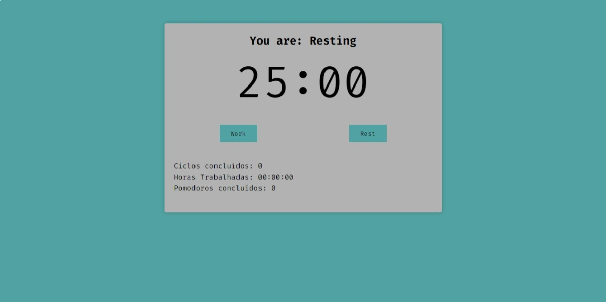

# React Card Form

Este é um aplicativo de temporizador Pomodoro construído com React e TypeScript. O Pomodoro é uma técnica de gerenciamento de tempo que ajuda você a aumentar a produtividade dividindo o trabalho em intervalos de foco e descanso.

## Funcionalidades

- Configuração personalizável do tempo de trabalho e intervalo
- Inicia, pausa e reinicia o temporizador
- Avisa quando o tempo de trabalho ou intervalo é concluído
- Contador de ciclos Pomodoro concluídos

## Design



## Pré-requisitos

Para executar este projeto, você precisará ter o [Node.js](https://nodejs.org/) instalado em seu computador.

## Executando o projeto

Para executar o projeto, siga as instruções abaixo:

1. Clone o repositório:

```bash
git clone https://github.com/murilonicemento/pomodoro.git
```

2. Instale as dependências:

```bash
cd pomodoro
npm install
```

3. Inicie o servidor de desenvolvimento:

```bash
npm start
```

O servidor de desenvolvimento será iniciado e o projeto estará disponível em http://localhost:3000.

## Contribuindo

Se você deseja contribuir para o projeto, siga as instruções abaixo:

1. Faça um fork do repositório:

2. Clone o repositório forkado:

```bash
git clone https://github.com/murilonicemento/pomodoro.git
```

3. Crie uma branch para a sua contribuição:

```bash
git checkout -b minha-contribuicao
```

4. Faça as alterações desejadas e faça commit das suas alterações:

```bash
git add .
git commit -m "Minha contribuição"
```

5. Faça um push das suas alterações para o repositório forkado:

```bash
git push origin minha-contribuicao
```

6. Abra um pull request no repositório original.

## Licença

Este projeto é licenciado sob a Licença MIT. Veja o arquivo [LICENSE](LICENSE) para mais detalhes.
